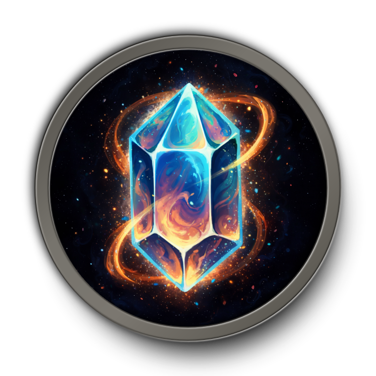

  

<h1 align="center">SparkPoint</h1>

  Cast rings, cooldown arcs, class resources, and assisted-combat cues around your cursor.

  
  
  
  

---

## Overview

SparkPoint is a lightweight, event-driven WoW addon that keeps important combat feedback near your cursor instead of pushing your eyes back to unit frames or action bars.

It currently includes:

- Cast ring with latency overlay, interrupt feedback, spell text, and click-feedback ring
- Up to 3 assignable ring slots
- Top bar slot with health and mana providers
- Class resource display in pip or text mode
- Decorative rotating ring
- Spell icon with cast swipe, instant-cast feedback, and cooldown-blocked feedback
- Assisted Highlight support for Blizzard's suggested-spell system
- Shared visibility rules, per-module overrides, and optional HUD transitions
- Cursor-attached mode, fixed anchor mode, minimap button, and profile support

## New In v1.4.0

- Added a new top bar slot module with dedicated health and mana providers
- Added full top bar slot styling controls for fill, background, frame, and provider-based coloring
- Added top bar slot text with configurable mode, number style, font, outline, opacity, and offsets
- Added slot-specific visibility settings and hide overrides for the top bar slot
- Added centralized HUD layer roots with live frame strata updates for cleaner layering across modules
- Added hide rules for pet battles and Blizzard special action bar contexts
- Improved top bar texture fidelity, baseline alignment, and fade behavior

## Previously In v1.3.x

- Added cast progress display modes for all casts, normal casts only, or channelled spells only
- Refactored cast fill color controls into explicit source modes, including single-color, split normal/channelled, and class-color behavior
- Added separate class-color toggles for cast spark and cast spell text
- Expanded visibility rules with hostile/unfriendly, neutral, and friendly target filters
- Added interrupt-flash feedback for interrupted channelled casts
- Added richer Spell Icon feedback for direct instant casts, triggered instant casts, failed casts, and readable cooldown-blocked presses
- Added a dedicated readable cooldown swipe color with optional class-color override
- Standardized slash commands to the `/sparkpoint` command family only
- Added HUD transition effects with configurable fade timing, easing, and show/hide hysteresis
- Added visibility control to hide SparkPoint while hovering clickable UI for cleaner world targeting
- Added customizable background tint colors for the cast ring and inner slot rings
- Added configurable class resource pip background color
- Added RGBA color control for the spell icon cast progress swipe
- Reorganized settings labels for clarity

## Features

### Cast Ring

The main cast ring renders around your cursor and supports:

- Cast progress with spark
- Reverse fill for channeled spells
- Latency arc
- Interrupt/failure flash
- Optional spell name text with configurable font, size, outline, color, and offsets
- Configurable fill color modes, including class color and separate channelled-cast color
- Independent class-color toggles for spark and spell text
- Configurable bar, spark, glow, frame, and background tint/opacity
- Click-feedback ring for left and right mouse buttons

### Ring Slots

SparkPoint supports up to **3 concentric inner slots** inside the cast ring.

- Each slot can be assigned independently
- Current provider: **GCD**
- Each slot has configurable bar color, background tint, opacity, and optional class-color override

### Top Bar Slot

SparkPoint supports a dedicated **top bar slot** positioned above the main cast ring.

- Current providers: **Health** and **Mana**
- Configurable fill color source, background tint, frame tint, and independent opacity controls
- Optional text overlay with current, max, and percent display modes
- Configurable text font, outline, number style, opacity, and offsets
- Slot-specific visibility override and hide rules

### Class Resource

Displays class-specific resources near your cursor in either **Pips** or **Text** mode.

**Pip mode supports:**
Paladin, Death Knight, Rogue, Druid, Arcane Mage, Windwalker Monk, Warlock, Evoker, and Enhancement Shaman

**Text mode additionally supports:**
Demon Hunter, Shadow Priest, Balance Druid, and Elemental Shaman

Configurable options include:

- Scale and opacity
- Separate offsets for the resource display
- Font, size, outline, and color for text mode
- Fill color, background tint, and class-color override for pip mode
- Per-module visibility override

### Decorative Ring

A stylized ring rendered around the cursor with:

- Multiple texture variants
- Optional rotation
- Configurable size and color
- Optional class-color tint with opacity control
- Per-module visibility override

### Spell Icon

Displays the icon of the currently cast spell below the ring.

- Optional cast-progress swipe
- Configurable swipe RGBA color
- Optional instant-cast icon display for direct casts
- Optional triggered instant-cast icon display for procs and follow-up effects
- Configurable failed-cast response
- Optional readable cooldown-blocked feedback with remaining-cooldown swipe
- Separate readable cooldown swipe color with optional class-color override
- Configurable size and offsets

### Assisted Highlight

Displays Blizzard Assisted Highlight's suggested spell near the SparkPoint HUD.

- Independent from the spell icon
- Icon opacity, glow, glow color, and positioning controls
- Optional breathing glow transition with speed and strength controls
- Optional keybind text with compact/full format, font, outline, size, opacity, color, and offsets
- Hidden automatically if Blizzard Assisted Highlight is disabled
- Per-module visibility override

### Visibility And Transitions

SparkPoint supports both addon-wide visibility rules and per-module overrides.

Available rules include:

- Always
- In Combat
- Out of Combat
- Has Target
- Has Alive Target
- Has Dead Target
- Has Hostile / Unfriendly Target
- Has Neutral Target
- Has Friendly Target
- While Casting
- After Instant Cast
- After Triggered Instant Cast
- In Party
- In Raid
- In Instanced Content

Additional behavior:

- Optional hide while hovering clickable UI
- Optional hide in pet battles
- Optional hide in Blizzard vehicle / override / possess / special action bar contexts
- Optional transition system with fade in/out durations, easing, and hysteresis

### Quality Of Life

- Attach to cursor or use a fixed anchor
- Minimap button with optional fade behavior
- Global or class-specific profiles
- Standardized `/sparkpoint` slash commands for settings and anchor control

## Installation

### Addon Manager

Install from CurseForge:

https://www.curseforge.com/wow/addons/sparkpoint

### Manual

1. Download the latest `.zip` from [GitHub Releases](../../releases).
2. Extract it to `World of Warcraft/_retail_/Interface/AddOns/`.
3. Confirm the final path is `Interface/AddOns/SparkPoint/SparkPoint.toc`.
4. Launch WoW and enable `SparkPoint` at character select.

## Configuration

### Slash Commands

| Command | Action |
| ------- | ------ |
| `/sparkpoint` | Open settings |
| `/sparkpoint unlock` | Unlock the anchor for manual drag placement |
| `/sparkpoint lock` | Lock the anchor |
| `/sparkpoint reset` | Reset to default cursor-attached positioning |

You can also open settings from the minimap button.

### Settings Layout

Open the Blizzard Settings panel via `/sparkpoint`. SparkPoint provides sections for:

- General
- Visibility
- Transition
- Modules
- Cast Ring
- Ring Slots
- Bar Slots
- Class Resource
- Decorative Ring
- Spell Icon
- Assisted Highlight
- Profiles

## Compatibility

- Supported interface versions: `12.0.0` and `12.0.1`
- No external libraries required

## License

[GPL-3.0](LICENSE)
